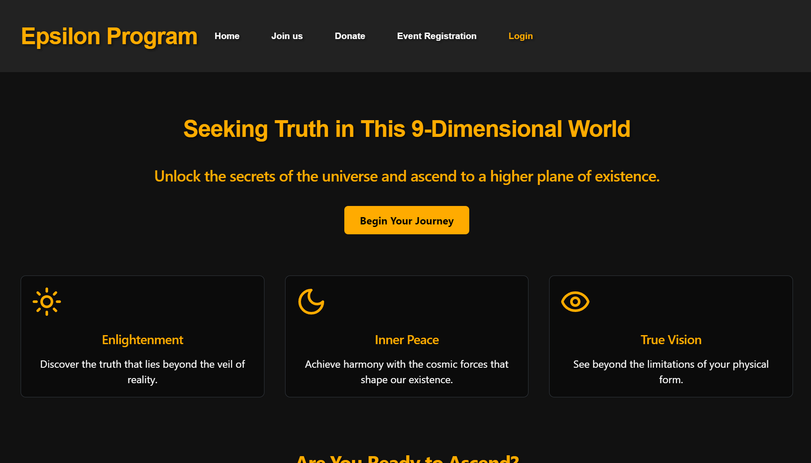

# Epsilon Program Recruitment Website

## Table of Contents

1. [Introduction](#introduction)
2. [Features](#features)
3. [Technologies Used](#technologies-used)
4. [Getting Started](#getting-started)
5. [Usage](#usage)
6. [Contributing](#contributing)
7. [License](#license)

## Introduction

This repository contains the code for the Epsilon Program recruitment website, inspired by the fictional organization from Grand Theft Auto V. The website serves as a platform for user engagement, event management, and program support.


## Features

- **User Authentication**:
  - Role-based login and signup functionality
- **Subscription Management**:
  - Users can purchase subscriptions
- **Donation System**:
  - Support the program through monetary contributions
- **Event Management**:
  - Admins can create and post events
  - Users can view and register for events
- **Testimonials**:
  - Display of (fictional) member testimonials

## Technologies Used

- **Frontend**:
  - Vite + React
- **Backend**:
  - Node.js
- **Database**:
  - MongoDB

## Getting Started

1. Clone the repository:
   ```
   git clone https://github.com/drumilbhati/Website.git
   ```
2. Install dependencies:
   ```
   pnpm install
   ```
3. Set up environment variables (create a `.env` file in the backend directory):
   ```
   DATABASE_URL=your_mongodb_connection_string
   JWT_SECRET=your_jwt_secret
   PORT = your_port
   ```
4. Start the development server in the root directory:
   ```
   pnpm run dev
   ```

## Usage

1. **User Registration/Login**:

   - Navigate to the signup page to create a new account
   - Use the login page to access your existing account

2. **Subscription Purchase**:

   - After logging in, navigate to the Join Us page
   - Choose a subscription plan and complete the purchase process

3. **Donations**:

   - Use the donation feature to contribute to the Epsilon Program

4. **Event Management** (Admin):

   - Access the admin panel through admin login to create and post new events

5. **Event Participation** (Users):

   - Browse available events on the events page
   - Register for events of interest

6. **View Testimonials**:
   - Check out the testimonials section on the homepage to read about member experiences

## Contributing

We welcome contributions to the Epsilon Program Recruitment Website! Please follow these steps:

1. Fork the repository
2. Create a new branch (`git checkout -b feature/AmazingFeature`)
3. Commit your changes (`git commit -m 'Add some AmazingFeature'`)
4. Push to the branch (`git push origin feature/AmazingFeature`)
5. Open a Pull Request

## License

This project is licensed under the [Apache License 2.0](LICENSE).
